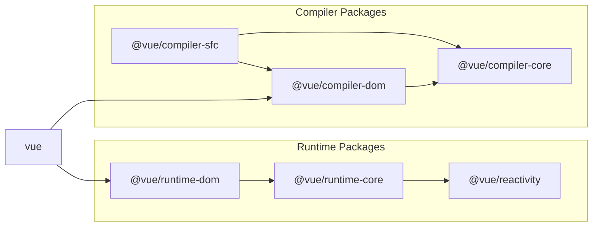

::translate
# Vuejs 贡献指南

#translate
Vue.js Contributing Guide
::

::translate
嗨！我很高兴你有兴趣为Vue.js做出贡献。在提交你的贡献之前，请务必花点时间阅读以下指南：

#translate
Hi! I'm really excited that you are interested in contributing to Vue.js. Before submitting your contribution, please make sure to take a moment and read through the following guidelines:
::

::translate
- [行为准则](https://vuejs.org/about/coc.html)
- [发布报告指南](#issue-reporting-guidelines)
- [Pull Request指南](#pull-request-guidelines)
- [开发设置](#development-setup)
- [脚本](#scripts)
- [项目结构](#project-structure)
- [测试指南](#contributing-tests)
- [资金贡献](#financial-contribution)


#translate
- [Code of Conduct](https://vuejs.org/about/coc.html)
- [Issue Reporting Guidelines](#issue-reporting-guidelines)
- [Pull Request Guidelines](#pull-request-guidelines)
- [Development Setup](#development-setup)
- [Scripts](#scripts)
- [Project Structure](#project-structure)
- [Contributing Tests](#contributing-tests)
- [Financial Contribution](#financial-contribution)
::


::translate
## Issue提交指南
#translate
## Issue Reporting Guidelines
::

::translate
- 使用[https://new-issue.vuejs.org/](https://new-issue.vuejs.org/)提交新的Issue.
#translate
- Always use [https://new-issue.vuejs.org/](https://new-issue.vuejs.org/) to create new issues.
::


::translate
## Pull Request指南
#translate
## Pull Request Guidelines
::

::translate
### 哪些类型的Pull request会被接受？
#translate
### What kinds of Pull Requests are accepted?
::

- ::translate
  修复一个明确识别的Bug。**明确识别的bug**意味着该bug可以从相关的公开问题中正常复制，或者被包含在PR本身中。避免提交声称要修复的pr，但没有充分解释正在修复的内容。
  #translate
  Bug fix that addresses a clearly identified bug. **"Clearly identified bug"** means the bug has a proper reproduction either from a related open issue, or is included in the PR itself. Avoid submitting PRs that claim to fix something but do not sufficiently explain what is being fixed.
  ::
- ::translate
  新特性解决了一个解释清楚和广泛适用的用例。**广泛适用**意味着新功能应该为大多数用户群提供重要的改进。Vue已经有了一个很大的API接口，所以我们在添加新功能时非常谨慎——如果用例是小众的，并且可以通过用户层实现解决，那么它可能不适合进入核心。
  #translate
  New feature that addresses a clearly explained and widely applicable use case. **"Widely applicable"** means the new feature should provide non-trivial improvements to the majority of the user base. Vue already has a large API surface so we are quite cautious about adding new features - if the use case is niche and can be addressed via userland implementations, it likely isn't suitable to go into core.
  ::

::translate
  特性实现还应该考虑增加的复杂性与获得的好处之间的权衡。例如，如果一个小功能需要在整个代码库中进行重大修改，那么很可能不值得，或者应该重新考虑该方法。
#translate
  The feature implementation should also consider the trade-off between the added complexity vs. the benefits gained. For example, if a small feature requires significant changes that spreads across the codebase, it is likely not worth it, or the approach should be reconsidered.
::
::translate
  如果该特性具有重要的API添加，或者显著影响用户处理常见用例的方式，则应该首先在[RFC repo](https://github.com/vuejs/rfcs/discussions)中进行讨论。如果不事先讨论这些功能的pr，由于与具体实现耦合，将很难指导/调整API设计，并可能导致浪费的工作。
#translate
  If the feature has a non-trivial API surface addition, or significantly affects the way a common use case is approached by the users, it should go through a discussion first in the [RFC repo](https://github.com/vuejs/rfcs/discussions). PRs of such features without prior discussion make it really difficult to steer / adjust the API design due to coupling with concrete implementations, and can lead to wasted work.
::
::translate
- 拼写错误、注释改进、构建配置、CI配置等。对于拼写错误和注释更改，请尝试将多个错误组合到单个PR中。
#translate
- Chore: typos, comment improvements, build config, CI config, etc. For typos and comment changes, try to combine multiple of them into a single PR.
::
::translate
- **需要注意的是，我们不鼓励贡献者提交主要基于风格的代码重构。** 代码重构只有在它提高了性能，或者有充分的解释为什么它客观地提高了代码质量（例如使相关功能的实现更容易）的情况下才会被接受。
#translate
- **It should be noted that we discourage contributors from submitting code refactors that are largely stylistic.** Code refactors are only accepted if it improves performance, or comes with sufficient explanations on why it objectively improves the code quality (e.g. makes a related feature implementation easier).
::

::translate
  原因是代码的可读性是主观的。这个项目的维护者根据我们的偏好选择以当前的风格编写代码，我们不想花时间解释我们的风格偏好。贡献者在贡献代码时应该尊重已经建立的约定。
#translate
  The reason is that code readability is subjective. The maintainers of this project have chosen to write the code in its current style based on our preferences, and we do not want to spend time explaining our stylistic preferences. Contributors should just respect the established conventions when contributing code.
::

::translate
  它的另一个方面是，大规模的风格更改会导致涉及多个文件的大量差异，给git历史添加噪声，并使跟踪跨提交的行为更改更加麻烦。
#translate
  Another aspect of it is that large scale stylistic changes result in massive diffs that touch multiple files, adding noise to the git history and makes tracing behavior changes across commits more cumbersome.
::

::translate
### Pull Request检查表
#translate
### Pull Request Checklist
::

- ::translate
  Vue core有两个主要的工作分支：`main`和`minor`。
  #translate
  Vue core has two primary work branches: `main` and `minor`.
  ::

  - ::translate
    如果你的拉取请求是一个添加了新的API表面的功能，它应该在`minor`分支上提交。
    #translate
    f your pull request is a feature that adds new API surface, it should be submitted against the `minor` branch.
    ::
  - ::translate
    否则，它应该提交到`main`分支。
    #translate
    Otherwise, it should be submitted against the `main` branch.
    ::

- ::translate
  [确保勾选"Allow edits from maintainers"](https://docs.github.com/en/pull-requests/collaborating-with-pull-requests/working-with-forks/allowing-changes-to-a-pull-request-branch-created-from-a-fork)。这允许我们直接进行小的编辑/重构，从而节省了大量时间。
  #translate
  [Make sure to tick the "Allow edits from maintainers" box](https://docs.github.com/en/pull-requests/collaborating-with-pull-requests/working-with-forks/allowing-changes-to-a-pull-request-branch-created-from-a-fork). This allows us to directly make minor edits / refactors and saves a lot of time.
  ::

- ::translate
  如果添加一个新功能：
  #translate
  If adding a new feature:
  ::
  - ::translate
  添加相应的测试用例。
  #translate
  Add accompanying test case.
  ::
  - ::translate
  提供一个令人信服的理由来添加此功能。理想情况下，您应该首先打开一个建议问题，并在进行工作之前获得批准。
  #translate
  Provide a convincing reason to add this feature. Ideally, you should open a suggestion issue first and have it approved before working on it.
  ::

- ::translate
  如果修复一个bug：
  #translate
  If fixing a bug:
  ::
  - ::translate
    如果你正在解决一个特殊的问题，可以在你的PR标题中添加`(fix #xxxx[,#xxxx])` （#xxxx是问题id）以获得更好的发布日志，例如：`更新实体编码/解码（修复#3899）`。
    #translate
    If you are resolving a special issue, add `(fix #xxxx[,#xxxx])` (#xxxx is the issue id) in your PR title for a better release log, e.g. `update entities encoding/decoding (fix #3899)`.
    ::

  - ::translate
    在PR中提供bug的详细描述。最好是现场演示。
    #translate
    Provide a detailed description of the bug in the PR. Live demo preferred.
    ::
  - ::translate
    如果适用的话，添加适当的测试覆盖率。你可以通过运行`nr test-coverage`来检查代码添加的覆盖率。
    #translate
    Add appropriate test coverage if applicable. You can check the coverage of your code addition by running `nr test-coverage`.
    ::

- ::translate
  在PR中可以有多个小的提交——GitHub可以在合并之前自动压缩它们。
  #translate
  It's OK to have multiple small commits as you work on the PR - GitHub can automatically squash them before merging.
  ::
- ::translate
  确保测试通过！
  #translate
  Make sure tests pass!
  ::

- ::translate
  提交消息必须遵循[提交消息约定](./commit-convention.md)，以便自动生成更改日志。提交消息在提交之前会自动验证（通过[simple-git-hooks](https://github.com/toplenboren/simple-git-hooks)调用[Git Hooks](https://git-scm.com/docs/githooks)）。
  #translate
  Commit messages must follow the [commit message convention](./commit-convention.md) so that changelogs can be automatically generated. Commit messages are automatically validated before commit (by invoking [Git Hooks](https://git-scm.com/docs/githooks) via [simple-git-hooks](https://github.com/toplenboren/simple-git-hooks)).
  ::

- ::translate
  只要安装了开发依赖项，就无需担心代码风格——修改后的文件会在提交时用Prettier自动格式化（通过[simple-git-hooks](https://github.com/toplenboren/simple-git-hooks)调用[Git Hooks](https://git-scm.com/docs/githooks)）。
  #translate
  No need to worry about code style as long as you have installed the dev dependencies - modified files are automatically formatted with Prettier on commit (by invoking [Git Hooks](https://git-scm.com/docs/githooks) via [simple-git-hooks](https://github.com/toplenboren/simple-git-hooks)).
  ::


::translate
### 高级Pull Request提示
#translate
### Advanced Pull Request Tips
::

- ::translate
  PR应该**只**修复预期的bug，而不是引入无关的更改。这包括不必要的重构——PR应该专注于修复而不是代码风格，这使未来更容易跟踪更改。
  #translate
  The PR should fix the intended bug **only** and not introduce unrelated changes. This includes unnecessary refactors - a PR should focus on the fix and not code style, this makes it easier to trace changes in the future.
  ::

- ::translate
  考虑更改对性能/大小的影响，以及正在修复的bug是否与成本相符。如果正在修复的bug是一个非常小众的边缘情况，我们应该尝试最小化大小/性能成本，使其变得值得。
  #translate
  Consider the performance / size impact of the changes, and whether the bug being fixes justifies the cost. If the bug being fixed is a very niche edge case, we should try to minimize the size / perf cost to make it worthwhile.
  ::

  - ::translate
    代码是否对性能敏感（例如，在“热路径”中，如组件更新或vdom补丁函数？）
    #translate
    Is the code perf-sensitive (e.g. in "hot paths" like component updates or the vdom patch function?)
    ::

    - ::translate
      如果分支是perf-sensitive，性能更重要。
      #translate
      If the branch is dev-only, performance is less of a concern.
      ::

  - ::translate
    检查更改引入的额外包大小。
    #translate
    Check how much extra bundle size the change introduces.
    ::
    
    - ::translate
      确保将只用于开发的代码放在`__DEV__`分支中，以便它们是可tree-shakable优化的。
      #translate
      Make sure to put dev-only code in `__DEV__` branches so they are tree-shakable.
      ::
    - ::translate
      运行时代码比编译器代码对大小的增加更敏感。
      #translate
      Runtime code is more sensitive to size increase than compiler code.
      ::
    - ::translate
      确保它不会意外导致运行时构建中包含只支持开发者或只支持编译器的代码分支。值得注意的情况是，`@vue/shared`中的一些函数仅是编译器函数，不应该在运行时代码中使用，例如：`isHTMLTag`和`isSVGTag`。
      #translate
      Make sure it doesn't accidentally cause dev-only or compiler-only code branches to be included in the runtime build. Notable case is that some functions in `@vue/shared` are compiler-only and should not be used in runtime code, e.g. `isHTMLTag` and `isSVGTag`.
      ::

::translate
### 开发设置
#translate
## Development Setup
::

::translate
你需要[Node.js](https://nodejs.org)最低为[`.node-version`](https://github.com/vuejs/core/blob/main/.node-version)文件中指定的版本，[PNPM](https://pnpm.io)最低为[`package.json`中的 `packageManager` ](https://github.com/vuejs/core/blob/main/package.json#L4)指定的版本。
#translate
You will need [Node.js](https://nodejs.org) with minimum version as specified in the [`.node-version`](https://github.com/vuejs/core/blob/main/.node-version) file, and [PNPM](https://pnpm.io) with minimum version as specified in the [`"packageManager"` field in `package.json`](https://github.com/vuejs/core/blob/main/package.json#L4).
::

::translate
我们还建议安装 [@antfu/ni](https://github.com/antfu/ni)以帮助在使用不同包管理器的仓库之间切换。`ni`还提供了方便的`nr`命令，它可以更容易地运行NPM脚本。
#translate
We also recommend installing [@antfu/ni](https://github.com/antfu/ni) to help switching between repos using different package managers. `ni` also provides the handy `nr` command which running npm scripts easier.
::

::translate
克隆仓库后，运行：
#translate
After cloning the repo, run:
::

```bash
$ pnpm i # install the dependencies of the project
```

::translate
使用工具的概述：
#translate
A high level overview of tools used:
::

- ::translate
  [TypeScript](https://www.typescriptlang.org/)开发语言
  #translate
  [TypeScript](https://www.typescriptlang.org/) as the development language
  ::
- ::translate
  [Vite](https://vitejs.dev/) 和 [ESBuild](https://esbuild.github.io/)开发打包
  #translate
  [Vite](https://vitejs.dev/) and [ESBuild](https://esbuild.github.io/) for development bundling
  ::
- ::translate
  [Rollup](https://rollupjs.org)生产打包
  #translate
  [Rollup](https://rollupjs.org) for production bundling
  ::
- ::translate
  [Vitest](https://vitest.dev/)测试工具
  #translate
  [Vitest](https://vitest.dev/) for unit testing
  ::
- ::translate
  [Prettier](https://prettier.io/)代码格式化
  #translate
  [Prettier](https://prettier.io/) for code formatting
  ::
- ::translate
  [ESLint](https://eslint.org/) 用于预防静态错误（类型之外的错误）
  #translate
  [ESLint](https://eslint.org/) for static error prevention (outside of types)
  ::

::translate
## Git钩子函数
#translate
## Git Hooks
::

::translate
项目使用[simple-git-hooks](https://github.com/toplenboren/simple-git-hooks)对每次提交强制执行以下操作：
#translate
The project uses [simple-git-hooks](https://github.com/toplenboren/simple-git-hooks) to enforce the following on each commit:
::

- ::translate
  检查整个项目
  #translate
  Type check the entire project
  ::
- ::translate
  使用Prettier自动格式化更改的文件
  #translate
  Automatically format changed files using Prettier
  ::
- ::translate
  验证提交消息格式（逻辑在`scripts/verify-commit.js`中）
  #translate
  Verify commit message format (logic in `scripts/verify-commit.js`)
  ::

::translate
## 脚本
#translate
## Scripts
::

::translate
**下面的例子将使用 [@antfu/ni](https://github.com/antfu/ni) 包中的 nr 命令。** 你也可以使用普通的 `npm run`，但你需要在命令后添加一个额外的  `--`，然后传递所有额外的参数。例如，`nr build runtime --all` 等价于 `npm run build -- runtime --all`
#translate
**The examples below will be using the `nr` command from the [@antfu/ni](https://github.com/antfu/ni) package.** You can also use plain `npm run`, but you will need to pass all additional arguments after the command after an extra `--`. For example, `nr build runtime --all` is equivalent to `npm run build -- runtime --all`.
::

::translate
`run-s` 和 `run-p` 命令可以在某些脚本中找到 [npm-run-all](https://github.com/mysticatea/npm-run-all) 用于编排多个脚本。`run-s` 表示“按顺序运行”，而 `run-p` 表示“按并行运行”。
#translate
The `run-s` and `run-p` commands found in some scripts are from [npm-run-all](https://github.com/mysticatea/npm-run-all) for orchestrating multiple scripts. `run-s` means "run in sequence" while `run-p` means "run in parallel".
::

- [`nr build`](#nr-build)
- [`nr build-dts`](#nr-build-dts)
- [`nr check`](#nr-check)
- [`nr dev`](#nr-dev)
- [`nr dev-sfc`](#nr-dev-sfc)
- [`nr dev-esm`](#nr-dev-esm)
- [`nr dev-compiler`](#nr-dev-compiler)
- [`nr test`](#nr-test)
- [`nr test-dts`](#nr-test-dts)

### `nr build`

::translate
`build` 脚本用于构建所有公共包（即在其`package.json` 文件中没有设置 `private: true` 的包）。
#translate
The `build` script builds all public packages (packages without `private: true` in their `package.json`).
::
::translate
可以使用模糊匹配来指定要构建的包：
#translate
Packages to build can be specified with fuzzy matching:
::

```bash
# build runtime-core only  
# 仅构建 runtime-core 包
nr build runtime-core

# build all packages matching "runtime" 
# 构建所有名称中包含 "runtime" 的包
nr build runtime --all
```
::translate
请注意， `nr build` 使用 `rollup-plugin-esbuild` 进行 TypeScript 转译，并且 **不会执行类型检查**。若要对整个代码库运行类型检查，请运行  `nr check`。类型检查也会在每次提交时自动运行。
#translate
Note that `nr build` uses `rollup-plugin-esbuild` for transpiling typescript and **does not perform type checking**. To run type check on the entire codebase, run `nr check`. Type checks are also automatically run on each commit.
::

::translate
#### 构建格式
#translate
#### Build Formats
::

::translate
默认情况下，每个包将按照其 `package.json` 中的 `buildOptions.formats` 字段指定的多种格式进行构建。这些格式可以通过 `-f` 标志进行覆盖。支持的格式如下：
#translate
By default, each package will be built in multiple distribution formats as specified in the `buildOptions.formats` field in its `package.json`. These can be overwritten via the `-f` flag. The following formats are supported:
::

- **`global`**
- **`esm-bundler`**
- **`esm-browser`**
- **`cjs`**

::translate
此外，仅适用于主 vue 包的额外格式：
#translate
Additional formats that only apply to the main `vue` package:
::

- **`global-runtime`**
- **`esm-bundler-runtime`**
- **`esm-browser-runtime`**

::translate
有关这些格式的更多详细信息，请参阅[vue 包的 README](https://github.com/vuejs/core/blob/main/packages/vue/README.md#which-dist-file-to-use) 和[Rollup 配置文件](https://github.com/vuejs/core/blob/main/rollup.config.js)。
#translate
More details about each of these formats can be found in the [`vue` package README](https://github.com/vuejs/core/blob/main/packages/vue/README.md#which-dist-file-to-use) and the [Rollup config file](https://github.com/vuejs/core/blob/main/rollup.config.js).
::

::translate
例如，仅使用全局构建来构建 `runtime-core`:
#translate
For example, to build `runtime-core` with the global build only:
::

```bash
nr build runtime-core -f global
```

::translate
可以指定多个格式，以逗号分隔：
#translate
Multiple formats can be specified as a comma-separated list:
::
```bash
nr build runtime-core -f esm-browser,cjs
```

::translate
#### 构建时生成 Source Maps
#translate
#### Build with Source Maps
::

::translate
使用 `--sourcemap` 或 `-s` 标志可以在构建时生成 Source Maps。请注意，这会使构建过程变得更慢。
#translate
Use the `--sourcemap` or `-s` flag to build with source maps. Note this will make the build much slower.
::

### `nr build-dts`

::translate
此命令为所有包构建类型声明。它首先生成原始的`.d `。然后使用[rollup-plugin-dts](https://github.com/Swatinem/rollup-plugin-dts)将类型滚动到单个`.d. ts`文件中。每个包的Ts文件。
#translate
This command builds the type declarations for all packages. It first generates the raw `.d.ts` files in the `temp` directory, then uses [rollup-plugin-dts](https://github.com/Swatinem/rollup-plugin-dts) to roll the types into a single `.d.ts` file for each package.
::


### `nr check`

### `nr dev`

::translate
`dev`脚本在开发模式下以指定格式（默认：`global`）打包一个目标包（默认：`vue`）并监视更改。当你想在HTML页面中加载构建内容以便快速调试时，这很有用：
#translate
The `dev` script bundles a target package (default: `vue`) in a specified format (default: `global`) in dev mode and watches for changes. This is useful when you want to load up a build in an HTML page for quick debugging:
::

```bash
$ nr dev

> built: packages/vue/dist/vue.global.js
```

- ::translate
  **重要：** `dev`脚本的输出仅用于开发和调试。虽然它们有相同的运行时行为，但生成的代码永远不应该发布到npm。
  #translate
  **Important:** output of the `dev` script is for development and debugging only. While it has the same runtime behavior, the generated code should never be published to npm.
  ::

- ::translate
  `dev`脚本不支持模糊匹配——您必须指定完整的包名，例如。`nr dev runtime-core`。
  #translate
  The `dev` script does not support fuzzy match - you must specify the full package name, e.g. `nr dev runtime-core`.
  ::

- ::translate
  `dev`脚本支持通过`-f`参数指定构建格式，就像`build`脚本一样。
  #translate
  The `dev` script supports specifying build format via the `-f` flag just like the `build` script.
  ::

- ::translate
  `dev`脚本也支持`-s`参数来生成源映射，但这会使重建更慢。
  #translate
  The `dev` script also supports the `-s` flag for generating source maps, but it will make rebuilds slower.
  ::

- ::translate
  `dev`脚本支持`-i`参数，用于内联所有dep。当调试默认外部化deps的`esm-bundler`构建时，这很有用。
  #translate
  The `dev` script supports the `-i` flag for inlining all deps. This is useful when debugging `esm-bundler` builds which externalizes deps by default.
  ::

### `nr dev-sfc`

::translate
在本地开发模式下启动SFC Playground的快捷方式。当调试问题可以在SFC Playground中重现时，这提供了最快的反馈循环。
#translate
Shortcut for starting the SFC Playground in local dev mode. This provides the fastest feedback loop when debugging issues that can be reproduced in the SFC Playground.
::

### `nr dev-esm`

::translate
构建并监视`vue/dist/vue-runtime.esm-bundle .js`，使用esbuild将所有的deps内联。当在需要真实构建设置的复制版本中调试ESM构建时，这很有用：全局链接`packages/vue`，然后将其链接到正在调试的项目中。
#translate
Builds and watches `vue/dist/vue-runtime.esm-bundler.js` with all deps inlined using esbuild. This is useful when debugging the ESM build in a reproduction that requires real build setups: link `packages/vue` globally, then link it into the project being debugged.
::

### `nr dev-compiler`

::translate
`dev-compiler`脚本在`http://localhost:3000`上构建、监视并提供[Template Explorer](https://github.com/vuejs/core/tree/main/packages/template-explorer)。这在处理纯编译器问题时很有用。
#translate
The `dev-compiler` script builds, watches and serves the [Template Explorer](https://github.com/vuejs/core/tree/main/packages/template-explorer) at `http://localhost:3000`. This is useful when working on pure compiler issues.
::


### `nr test`

::translate
`test`脚本简单地调用`vitest`二进制文件，因此所有[vitest CLI选项]（https://vitest.dev/guide/cli.html#options）都可以使用。一些例子:
#translate
The `test` script simply calls the `vitest` binary, so all [Vitest CLI Options](https://vitest.dev/guide/cli.html#options) can be used. Some examples:
::

```bash
# run all tests in watch mode
$ nr test

# run once and exit (equivalent to `vitest run`)
$ nr test run

# run all tests under the runtime-core package
$ nr test runtime-core

# run tests in files matching the pattern
$ nr test <fileNamePattern>

# run a specific test in specific files
$ nr test <fileNamePattern> -t 'test name'
```
::translate
针对源代码的测试被分组在`nr test-unit`下，而针对在真实浏览器中运行的构建文件的测试被分组在`nr test-e2e`下。
#translate
Tests that test against source code are grouped under `nr test-unit`, while tests that test against built files that run in real browsers are grouped under `nr test-e2e`.
::

### `nr test-dts`

::translate
首先运行`nr build-dts`，然后验证`packages-private/dts-test`中的类型测试是否正确地针对实际构建类型声明工作。
#translate
Runs `nr build-dts` first, then verify the type tests in `packages-private/dts-test` are working correctly against the actual built type declarations.
::

::translate
## 项目结构
#translate
## Project Structure
::

::translate
此存储库采用[monorepo](https://en.wikipedia.org/wiki/Monorepo)设置，在`packages`目录下托管许多相关的包：
#translate
This repository employs a [monorepo](https://en.wikipedia.org/wiki/Monorepo) setup which hosts a number of associated packages under the `packages` directory:
::

- ::translate
  `reactivity`:响应式系统。它可以作为一个独立的、与框架无关的包使用。
  #translate
  `reactivity`: The reactivity system. It can be used standalone as a framework-agnostic package.
  ::

- ::translate
  `runtime-core`: 平台无关的运行时核心。包括虚拟 DOM 渲染器、组件实现和 JavaScript API 的代码。使用这个包可以创建针对特定平台的高阶运行时（即自定义渲染器）。
  #translate
  `runtime-core`: The platform-agnostic runtime core. Includes code for the virtual dom renderer, component implementation and JavaScript APIs. Higher-order runtimes (i.e. custom renderers) targeting specific platforms can be created using this package.
  ::

- ::translate
  `reactivity`: 针对浏览器的运行时。包括处理原生 DOM API、属性、特性、事件处理程序等。
  #translate
  `runtime-dom`: The runtime targeting the browser. Includes handling of native DOM API, attributes, properties, event handlers etc.
  ::

- ::translate
  `runtime-test`: 用于测试的轻量级运行时。它可以在任何 JavaScript 环境中使用，因为它“渲染”了一个纯 JavaScript 对象树。这个树可以用来断言正确的渲染输出。还提供了序列化树、触发事件和记录更新期间实际执行的节点操作的工具。
  #translate
 `runtime-test`: The lightweight runtime for testing. Can be used in any JavaScript environment since it "renders" a tree of plain JavaScript objects. The tree can be used to assert correct render output. Also provides utilities for serializing the tree, triggering events, and recording actual node operations performed during an update.
  ::

- ::translate
  `server-renderer`: 用于服务器端渲染的包。
  #translate
  `server-renderer`: Package for server-side rendering.
  ::

- ::translate
  `compiler-core`: 平台无关的编译器核心。包括编译器的可扩展基础和所有平台无关的插件。
  #translate
  `compiler-core`: The platform-agnostic compiler core. Includes the extensible base of the compiler and all platform-agnostic plugins.
  ::

- ::translate
  `compiler-dom`: 带有专门针对浏览器的附加插件的编译器。
  #translate
  `compiler-dom`: Compiler with additional plugins specifically targeting the browser.
  ::

- ::translate
  `compiler-sfc`: 用于编译 Vue 单文件组件的实用程序。
  #translate
  `compiler-sfc`: Lower level utilities for compiling Vue Single File Components.
  ::

- ::translate
  `compiler-ssr`: 生成针对服务器端渲染优化的渲染函数的编译器。
  #translate
  `compiler-ssr`: Compiler that produces render functions optimized for server-side rendering.
  ::

- ::translate
  `shared`: 跨多个包共享的内部实用程序（特别是运行时和编译器包都使用的与环境无关的实用程序）。
  #translate
  `shared`: Internal utilities shared across multiple packages (especially environment-agnostic utils used by both runtime and compiler packages).
  ::

- ::translate
  `vue`: 面外暴露的“完整构建”，包括运行时和编译器。
  #translate
  `vue`: The public facing "full build" which includes both the runtime AND the compiler.
  ::

- ::translate
  私有程序包：
  #translate
  Private utility packages:
  ::

  - ::translate
    `dts-test`: 包含针对生成的 dts 文件的类型测试。
    #translate
    `dts-test`: Contains type-only tests against generated dts files.
    ::

  - ::translate
    `sfc-playground`: 持续部署在 https://play.vuejs.org 的 playground。要在本地运行 playground，请使用 [`nr dev-sfc`](#nr-dev-sfc)。
    #translate
    `sfc-playground`: The playground continuously deployed at https://play.vuejs.org. To run the playground locally, use [`nr dev-sfc`](#nr-dev-sfc).
    ::

  - ::translate
    `template-explorer`: 用于调试编译器输出的开发工具，持续部署在 https://template-explorer.vuejs.org/。要在本地运行它，请运行 [`nr dev-compiler`](#nr-dev-compiler).
    #translate
    `template-explorer`: A development tool for debugging compiler output, continuously deployed at https://template-explorer.vuejs.org/. To run it locally, run [`nr dev-compiler`](#nr-dev-compiler).
    ::

::translate
## 导入包
#translate
### Importing Packages
::

::translate
这些包可以使用它们的包名直接相互导入。请注意，在导入包时，应该使用其`package.json`中列出的名称。大多数情况下，`@vue/`前缀是需要的：
#translate
The packages can import each other directly using their package names. Note that when importing a package, the name listed in its `package.json` should be used. Most of the time the `@vue/` prefix is needed:
::

```js
import { h } from '@vue/runtime-core'
```

::translate
这可以通过以下几个配置实现：
#translate
This is made possible via several configurations:
::

- ::translate
  TypeScript的`tsconfig.json`配置`compilerOptions.paths`
  #translate
  For TypeScript, `compilerOptions.paths` in `tsconfig.json`
  ::
- ::translate
  Vitest和Rollup在`scripts/aliases.js`中共享同一组别名。
  #translate
  Vitest and Rollup share the same set of aliases from `scripts/aliases.js`
  ::
- ::translate
  对于普通的Node.js，它们使用[PNPM Workspaces](https://pnpm.io/workspaces)进行链接。
  #translate
  For plain Node.js, they are linked using [PNPM Workspaces](https://pnpm.io/workspaces).
  ::

::translate
### 包的依赖关系
#translate
### Package Dependencies
::



::translate
跨包导入时需要遵循一些规则：
#translate
There are some rules to follow when importing across package boundaries:
::

- ::translate
  当从另一个包中导入项目时，不要使用直接相对路径——在源包中导出它并在包级别导入它。
  #translate
  Never use direct relative paths when importing items from another package - export it in the source package and import it at the package level.
  ::

- ::translate
  编译器包不应该从运行时导入项，反之亦然。如果某些东西需要在编译器端和运行时端之间共享，那么它应该被提取到`@vue/shared`中。
  #translate
  Compiler packages should not import items from the runtime, and vice versa. If something needs to be shared between the compiler-side and runtime-side, it should be extracted into `@vue/shared` instead.
  ::

- ::translate
  如果一个包(a)有一个非类型导入，或者从另一个包(B)中重新导出了一个类型，那么(B)应该作为依赖项列在(a)的`package.json`中。这是因为依赖包被外部化在ESM-bundler/CJS的构建和类型声明文件中，所以在从包注册中心使用依赖包时，必须将依赖包实际安装为依赖。
  #translate
  If a package (A) has a non-type import, or re-exports a type from another package (B), then (B) should be listed as a dependency in (A)'s `package.json`. This is because the packages are externalized in the ESM-bundler/CJS builds and type declaration files, so the dependency packages must be actually installed as a dependency when consumed from package registries.
  ::

::translate
## 贡献测试
#translate
## Contributing Tests
::

::translate
单元测试与每个包中被测试的代码一起放置在名为`__tests__`的目录中。关于如何编写新的测试规范，请参阅[Vitest docs](https://vitest.dev/api/) 和现有的测试用例。下面是一些额外的指导原则。
#translate
Unit tests are collocated with the code being tested in each package, inside directories named `__tests__`. Consult the [Vitest docs](https://vitest.dev/api/) and existing test cases for how to write new test specs. Here are some additional guidelines:
::

- ::translate
  使用测试用例所需的最少API。例如，如果一个测试可以在不涉及响应式系统或组件的情况下编写，那么它应该这样编写。这限制了测试对不相关部分的变化的暴露，并使其更稳定。
  #translate
  Use the minimal API needed for a test case. For example, if a test can be written without involving the reactivity system or a component, it should be written so. This limits the test's exposure to changes in unrelated parts and makes it more stable.
  ::

- ::translate
  如果测试平台无关的行为或断言低级虚拟DOM操作，请使用`@vue/runtime-test`。
  #translate
  If testing platform agnostic behavior or asserting low-level virtual DOM operations, use `@vue/runtime-test`.
  ::

- ::translate
  只有在测试断言平台相关的行为时，才使用平台相关的运行时。
  #translate
  Only use platform-specific runtimes if the test is asserting platform-specific behavior.
  ::

::translate
测试覆盖率持续部署在https://coverage.vuejs.org上。提高测试覆盖率的pr是受欢迎的，但一般来说，测试覆盖率应被用作寻找未被测试覆盖的API用例的指导。我们不建议添加只提高覆盖率而不实际测试有意义的用例的测试。
#translate
Test coverage is continuously deployed at https://coverage.vuejs.org. PRs that improve test coverage are welcome, but in general the test coverage should be used as a guidance for finding API use cases that are not covered by tests. We don't recommend adding tests that only improve coverage but not actually test a meaning use case.
::

::translate
### 测试类型定义的正确性
#translate
### Testing Type Definition Correctness
::

::translate
类型测试位于`packages-private/dts-test`目录中。若要运行dts测试，请运行`nr test-dts`。注意，类型测试需要所有相关的`*.d. d `。首先构建Ts的文件（脚本会帮你完成）。一次是d。`nr test-dts `文件是最新构建的，可以通过运行`nr test-dts-only`重新运行测试。
#translate
Type tests are located in the `packages-private/dts-test` directory. To run the dts tests, run `nr test-dts`. Note that the type test requires all relevant `*.d.ts` files to be built first (and the script does it for you). Once the `d.ts` files are built and up-to-date, the tests can be re-run by running `nr test-dts-only`.
::

::translate
## 资金贡献
#translate
## Financial Contribution
::

::translate
作为一个没有大公司支持的纯社区驱动的项目，我们也欢迎Patreon和OpenCollective的资金贡献。

#translate
As a pure community-driven project without major corporate backing, we also welcome financial contributions via Patreon and OpenCollective.
::

- [Become a backer or sponsor on Patreon](https://www.patreon.com/evanyou)
- [Become a backer or sponsor on OpenCollective](https://opencollective.com/vuejs)

### What's the difference between Patreon and OpenCollective funding?

::translate
通过Patreon捐赠的资金直接支持Evan You在Vue.js上的全职工作。通过OpenCollective捐赠的资金以透明的费用管理，将用于补偿核心团队成员的工作和费用或赞助社区活动。您的名字/logo将通过在两个平台上的捐赠获得适当的识别和曝光。
#translate
Funds donated via Patreon go directly to support Evan You's full-time work on Vue.js. Funds donated via OpenCollective are managed with transparent expenses and will be used for compensating work and expenses for core team members or sponsoring community events. Your name/logo will receive proper recognition and exposure by donating on either platform.
::

## Credits

Thank you to all the people who have already contributed to Vue.js!

<a href="https://github.com/vuejs/core/graphs/contributors"></a>
